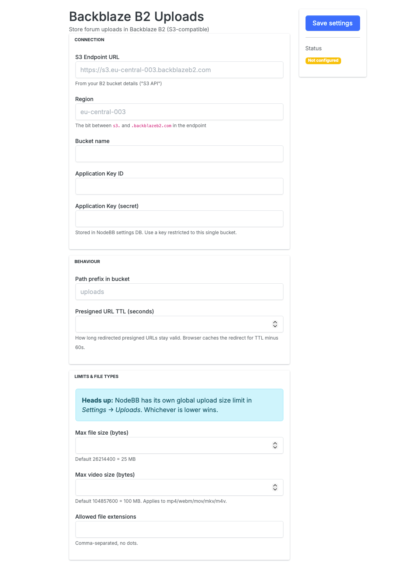

# nodebb-plugin-backblaze-b2-s3-uploads

Stores NodeBB forum uploads in **Backblaze B2** through the S3-compatible API. Files are served through a permission-aware proxy that issues short-lived presigned URLs, so:

- Uploads in **public categories** are reachable by anonymous visitors (still through the proxy, which checks `topics:read` for guests).
- Uploads in **private categories** require the visitor to have `topics:read` on that category.
- Direct B2 URLs are never put into post content — only opaque proxy URLs are, so leaked links die with the user's session/permission.

## How it works

1. User uploads a file. Plugin intercepts `filter:uploadFile` / `filter:uploadImage`, streams the file to B2, stores `{uid, name, type, size}` keyed by the B2 object key in NodeBB's database.
2. Post content references the file as `/uploads/b2/<key>`.
3. On `action:post.save` / `action:post.edit`, the plugin scans the post and links each referenced key to `{pid, tid, cid}`.
4. When a browser requests `/uploads/b2/<key>`, the plugin checks `privileges.categories.can('topics:read', cid, uid)`, generates a fresh presigned URL with TTL from settings, and 302-redirects.
5. The 302 is `Cache-Control: private, max-age=(TTL - 60s)` so the browser doesn't hit NodeBB on every image load.

## Install

```bash
cd /path/to/nodebb
npm install git+https://github.com/sqlik/nodebb-plugin-backblaze-b2-s3-uploads.git
./nodebb activate nodebb-plugin-backblaze-b2-s3-uploads
./nodebb restart
```

Or for local development, link the directory:

```bash
cd /path/to/nodebb-plugin-backblaze-b2-s3-uploads && npm install
cd /path/to/nodebb && npm install /path/to/nodebb-plugin-backblaze-b2-s3-uploads
./nodebb activate nodebb-plugin-backblaze-b2-s3-uploads
./nodebb restart
```

## Configure

Open **ACP → Plugins → Backblaze B2 Uploads (S3 API)** and fill in the fields:




| Field | Example | Notes |
|---|---|---|
| S3 Endpoint | `https://s3.eu-central-003.backblazeb2.com` | From your B2 bucket details ("S3 API") |
| Region | `eu-central-003` | The bit between `s3.` and `.backblazeb2.com` |
| Bucket name | `forum-uploads` | Bucket must be **Private** |
| Application Key ID | `0035…` | Use a key restricted to **this single bucket** |
| Application Key | `K003…` | Stored in NodeBB settings DB |
| Path prefix | `uploads` | All keys go under this prefix |
| Presigned URL TTL | `600` | Seconds. 600 = 10 min. Max 604800 (7 days). |
| Max file size | `26214400` | 25 MB default |
| Max video size | `104857600` | 100 MB default |
| Allowed extensions | `jpg,jpeg,png,…` | Comma separated |

> **Heads-up:** NodeBB has its own global upload limit in **Settings → Uploads**. The lower of the two wins.

## Recommended B2 setup

1. Create a **Private** bucket.
2. Create an **Application Key** scoped to *only* that bucket, with `read+write` permissions.
3. Optionally add a CORS rule allowing your forum origin (only matters if you add direct browser uploads later — not needed for the proxy flow).

## Roadmap

- [ ] Bunny CDN Pull Zone integration with token auth
- [ ] Background cleanup of orphaned objects (uploads never associated with a post)
- [ ] Migration command for existing local uploads
- [ ] Per-user / per-group upload quotas

## License

MIT
